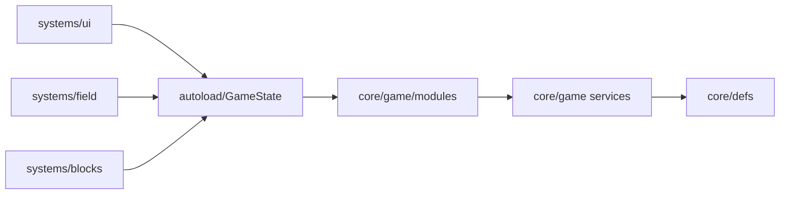

# Архитектура Upload Simulator

Проект организован по **игровым системам**. Глобальные autoload и чистая логика отделены от UI и сцены.

## Дерево `scripts/`

```
scripts/
  autoload/          # GameState, BgmPlayer, DebugOverlay
  core/
    defs/            # BlockDefs, GridDefs, FileDefs, EnvironmentUpgradeDefs
    game/            # состояние, сервисы, модели (RefCounted)
      modules/       # фасады API для autoload GameState
  systems/
    field/           # карта, камера, установка, провода на поле
    blocks/          # PlacedBlock, порты, тема модуля
    wiring/          # отрисовка проводов (UI)
    ui/              # HUD, магазин, MinimalUI
    visual/          # фон, сетка, неоновые рамки
  debug/             # отладочный оверлей (F3)
```

## Сцены

```
scenes/
  main.tscn
  blocks/placed_block.tscn
```

## Тесты

```
tests/
  test_runner.gd     # headless-раннер
  unit/              # наборы test_*.gd
```

Запуск локально:

```bash
godot --headless --path . -s res://tests/test_runner.gd

См. также [SETUP.md](SETUP.md) — клонирование и запуск на новом ПК, [MODULES.md](MODULES.md) — как добавить новый тип модуля.
```

## Debug overlay

Autoload `DebugOverlay` показывает FPS, кассу, фазы, очереди и диск. **F3** — показать/скрыть (в debug-сборке включён по умолчанию).

## GameState (autoload)

Фасад `scripts/autoload/game_state.gd` держит **сигналы**, тик пайплайна и публичные **модули API**:

| Модуль | Файл | Назначение |
|--------|------|------------|
| `access` | `game_state_access.gd` | снимок: деньги, очереди, фаза, провода |
| `field` | `game_state_field.gd` | поле: склад, покупка, установка, улучшения |
| `display` | `game_state_display.gd` | метрики и кнопки на модуле |
| `wiring` | `game_state_wiring.gd` | соединения портов |
| `storage` | `game_state_storage.gd` | диск |
| `pipeline` | `game_state_pipeline.gd` | скачивание, выгрузка, сбор денег |
| `environment` | `game_state_environment.gd` | открытие типов модулей и улучшения среды за алмазы |

Логика — в сервисах (`GameFieldService`, …); модули только делегируют. Пример: `GameState.field.place_block(...)`, `GameState.access.get_money()`.

## Поток данных


